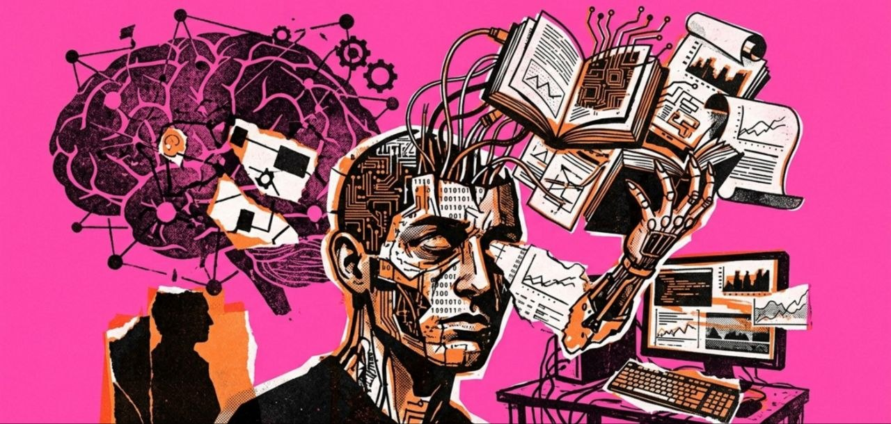

# Papers

This repository documents all the research papers I'm studying throughout my AI/ML learning journey.The list is continuously updated as I progress.

---

## Foundations, CNNs & Architectural Building Blocks

### Backbone Architectures
* **[01]** [AlexNet: ImageNet Classification with Deep Convolutional Neural Networks](https://cvml.ista.ac.at/courses/DLWT_W17/material/AlexNet.pdf)
* **[02]** [VGG: Very Deep Convolutional Networks for Large-Scale Image Recognition](https://arxiv.org/abs/1409.1556)  
* **[03]** [ResNet: Deep Residual Learning for Image Recognition](https://arxiv.org/abs/1512.03385)  
* **[10]** [Inception/GoogLeNet: Going Deeper with Convolutions](https://arxiv.org/abs/1409.4842) 
* **[11]** [EfficientNet: Rethinking Model Scaling for Convolutional Neural Networks](https://arxiv.org/abs/1905.11946)

### Optimization, Normalization & Activation
* **[06]** `Activation` [Empirical Evaluation of Rectified Activations in Convolutional Network (ELU/LeakyReLU)](https://arxiv.org/abs/1505.00853) 
* **[09]** `Activation` [Searching for Activation Functions (Swish)](https://arxiv.org/abs/1710.05941)   
* **[33]** `Normalization` [Batch Normalization: Accelerating Deep Network Training by Reducing Internal Covariate Shift](https://arxiv.org/abs/1502.03167)
* **[42]** `Optimizer` [ADAM: A Method for Stochastic Optimization](https://arxiv.org/abs/1412.6980)
* **[43]** `Optimizer` [Lookahead Optimizer: k steps forward, 1 step back](https://arxiv.org/abs/1907.08610)
* **[49]** `Optimizer` [AdaGrad stepsizes: Sharp convergence over nonconvex landscapes](https://arxiv.org/abs/1806.01811)

---

## Computer Vision Tasks

### Object Detection & Segmentation
* **[04]** [R-CNN: Rich feature hierarchies for accurate object detection and semantic segmentation](https://arxiv.org/abs/1311.2524)  
* **[05]** [Fast R-CNN](https://arxiv.org/abs/1504.08083)  
* **[25]** [YOLO: You Only Look Once: Unified, Real-Time Object Detection](https://arxiv.org/abs/1506.02640)  
* **[40]** [U-Net: Convolutional Networks for Biomedical Image Segmentation](https://arxiv.org/abs/1505.04597)

### Optical Flow & Style Transfer
* **[08]** [A Neural Algorithm of Artistic Style](https://arxiv.org/abs/1508.06576) 
* **[36]** [Arbitrary Style Transfer in Real-time with Adaptive Instance Normalization (AdaIN)](https://arxiv.org/abs/1703.06868)
* **[38]** [FlowNet: Learning Optical Flow with Convolutional Networks](https://arxiv.org/abs/1504.06852)

---

## Recurrent Networks & Sequence Modeling

* **[07]** [Empirical Evaluation of Gated Recurrent Neural Networks on Sequence Modeling](https://arxiv.org/abs/1412.3555)  
* **[12]** [Sequence to Sequence Learning with Neural Networks](https://arxiv.org/abs/1409.3215) 
* **[13]** [Neural Machine Translation by Jointly Learning to Align and Translate](https://arxiv.org/abs/1409.0473)
* **[17]** [Show and Tell: A Neural Image Caption Generator](https://arxiv.org/abs/1411.4555) 

---

## Transformers, LLMs & Tokenization

### Transformer Architectures
* **[18]** [Attention Is All You Need](https://arxiv.org/abs/1706.03762)
* **[19]** [BERT: Pre-training of Deep Bidirectional Transformers for Language Understanding](https://arxiv.org/abs/1810.04805)
* **[21]** [GPT-1: Improving Language Understanding by Generative Pre-Training](https://cdn.openai.com/research-covers/language-unsupervised/language_understanding_paper.pdf)
* **[26]** [ViT: An Image is Worth 16x16 Words: Transformers for Image Recognition at Scale](https://arxiv.org/abs/2010.11929)

### Tokenization Strategy
* **[30]** [CANINE: Pre-training an Efficient Tokenization-Free Encoder for Language Representation](https://arxiv.org/abs/2103.06874)
* **[31]** [SentencePiece: A simple and language independent subword tokenizer and detokenizer](https://arxiv.org/abs/1808.06226)
* **[32]** [BPE: Neural Machine Translation of Rare Words with Subword Units](https://arxiv.org/abs/1508.07909)
* **[52]** [Ultimate Guide to Fine-Tuning LLMs from Basics to Breakthroughs](https://arxiv.org/html/2408.13296v1)

---

## Generative Modeling & Diffusion

### Autoencoders & GANs
* **[20]** [Extracting and Composing Robust Features with Denoising Autoencoders](https://www.researchgate.net/publication/221346269_Extracting_and_composing_robust_features_with_denoising_autoencoders)
* **[39]** [Auto-Encoding Variational Bayes (VAE)](https://arxiv.org/abs/1312.6114)
* **[14]** [Generative Adversarial Nets (GAN)](https://arxiv.org/abs/1406.2661)
* **[15]** [DCGAN: Unsupervised Representation Learning with Deep Convolutional Generative Adversarial Networks](https://arxiv.org/abs/1511.06434)
* **[16]** [Conditional Generative Adversarial Nets (cGAN)](https://arxiv.org/abs/1411.1784)
* **[22]** [Least Squares Generative Adversarial Networks (LSGAN)](https://arxiv.org/abs/1611.04076)
* **[24]** [CycleGAN: Unpaired Image-to-Image Translation using Cycle-Consistent Adversarial Networks](https://arxiv.org/abs/1703.10593)
* **[34]** [CartoonGAN: Generative Adversarial Networks for Photo Cartoonization](https://openaccess.thecvf.com/content_cvpr_2018/papers/Chen_CartoonGAN_Generative_Adversarial_CVPR_2018_paper.pdf)
* **[37]** [Video-to-Video Synthesis](https://arxiv.org/abs/1808.06601)
* **[41]** [Self-Attention Generative Adversarial Networks (SAGAN)](https://arxiv.org/abs/1805.08318)

### Diffusion Models
* **[28]** [Denoising Diffusion Probabilistic Models (DDPM)](https://arxiv.org/abs/2006.11239) 
* **[29]** [Denoising Diffusion Implicit Models (DDIM)](https://arxiv.org/abs/2010.02502) 

---

## Vision-Language Models (VLM)

* **[47]** [DeepSeek-OCR: Context-Aware Visual Text Extraction](https://arxiv.org/abs/2510.18234)
* **[48]** [DeepSeek-OCR 2: Visual Causal Flow Scaling for Document Understanding](https://arxiv.org/abs/2601.20552)

---

## AI Science, Operators & Continual Learning

* **[27]** `Continual Learning` [Continual Learning with Deep Generative Replay](https://arxiv.org/abs/1705.08690) 
* **[35]** `Few-Shot Learning` [Few-Shot Adversarial Learning of Realistic Neural Talking Head Models](https://arxiv.org/abs/1905.08233)
* **[50]** `Neural Operators` [DeepONet: Learning nonlinear operators for identifying differential equations based on the universal approximation theorem of operators](https://arxiv.org/abs/1910.03193)
* **[51]** `Physics-Informed ML` [Physics-Informed Latent Neural Operator for Real-time Predictions of Complex Physical Systems](https://arxiv.org/abs/2303.01055)